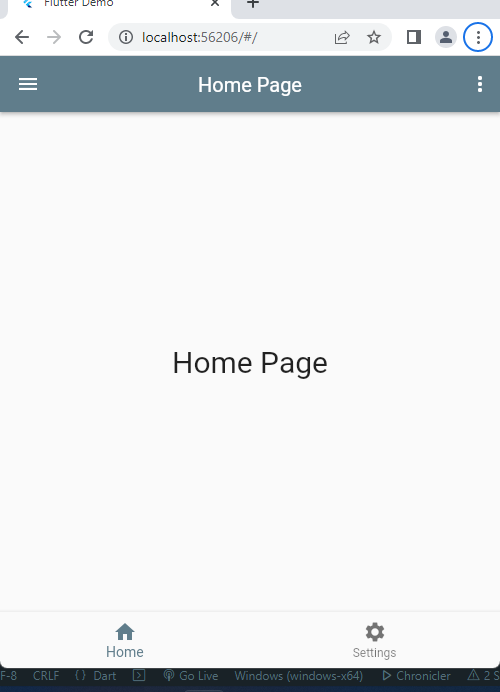

# Flutter 3.7 Material UI App Template
App Template with Expandable App Drawer Menu and Popup Action Menu with Bottom Tab Bar.

1. App Drawer Expandable list.

2. Zero Dependency

3. BottomTab with AppBar Title Change

## Installation
After cloning this repository, Run the following commands:
```bash
  flutter pub get
```


## Screenshot




## 🔗 Links
[](https://www.linkedin.com/arrahmanbd)